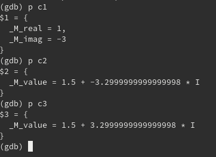
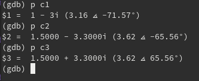
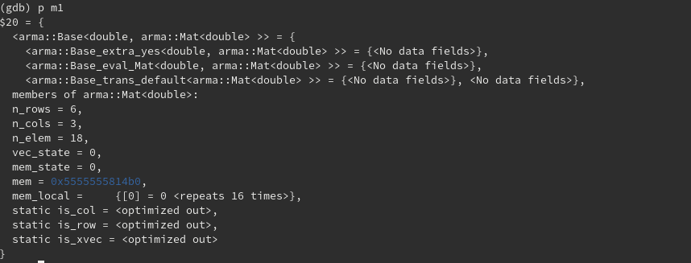
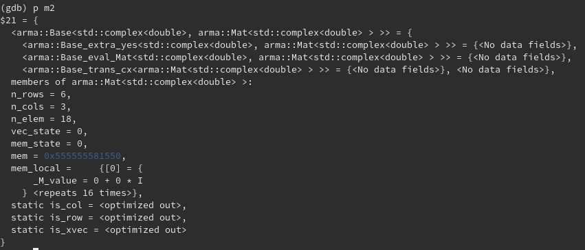
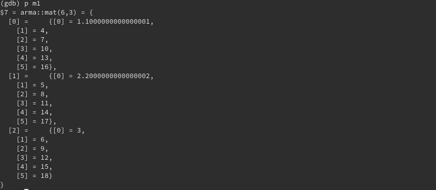
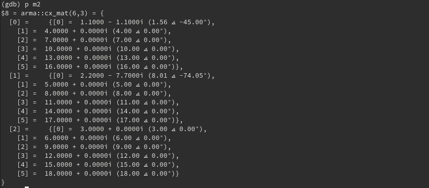
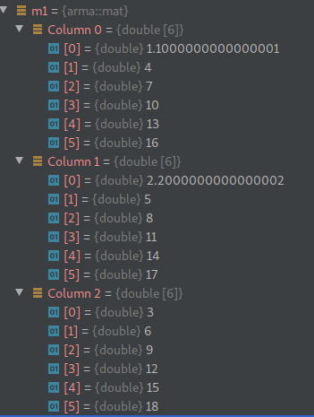
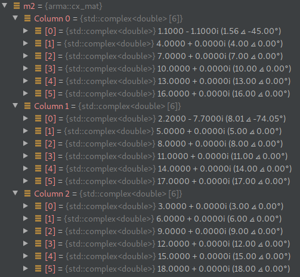

# GDB Armadillo helpers

This included pretty printers for [armadillo](http://arma.sourceforge.net/)
vectors, matrices and cubes, as well as a few xmethods.

It also includes a pretty printer for `std::complex<int>` and
`std::complex<double>` to make the output nicer.


## Using these pretty printers

Clone this repository to some folder and add the code below to the .gdbinit in
your home folder

```gdb
source /path_where_you_cloned/gdb_armadillo_helpers/gdb_helpers/gdb_armadillo_printers.py
source /path_where_you_cloned/gdb_armadillo_helpers/gdb_helpers/gdb_std_complex_printer.py
```

After that just use `p some_variable` in gdb to see the result nicely formatted
using gdb native format for arrays. This means that it will work better if you
have `set print array on` in your `.gdbinit` file.

**Note**: This also works inside CLion and possible in other IDEs.

## Screenshots

Consider the variables below

```c++
std::complex<int> c1(1, -3);
std::complex<double> c2(1.5, -3.3);
std::complex<double> c3(1.5, 3.3);

arma::mat m1{{1.1, 2.2, 3}, //
               {4, 5, 6},     //
               {7, 8, 9},     //
               {10, 11, 12},  //
               {13, 14, 15},  //
               {16, 17, 18}};

arma::cx_mat m2{{1.1 - 1.1j, 2.2 - 7.7j, 3},
                {4, 5, 6},
                {7, 8, 9},
                {10, 11, 12},
                {13, 14, 15},
                {16, 17, 18}};
```

When print the complex numbers without the pretty printers we get



With the pretty printers we get (notice the complex numbers are shown both in
rectangular form and in polar form)



For the armadillo variables, without the pretty printers we get





You can see some internal data and the dimension of the matrix, but not the
elements. It is possible to see the elements using gdb support for creating
arrays and the fact that the stored elements are pointed by the `mem` variable.
That is, use the command

```gdb
p (*m1.mem)@6@3
```

While this works, it requires manually specifying the dimensions and it is not
directly accessible. On the other hand, with pretty printers we get (notice that
the dimensions is also shown and how `arma::cx_mat` uses the pretty printer for
complex numbers)





This will even work in IDEs, such as CLion, as shown below






**Note**: The dimensions in the printing for matrices were swapped on purpose.
That is, the first dimension indicates the column index, while the second one
indicates the row index.

## Configuration

You can set the value of the `arma-show-content` parameter to enable (default)
or disable the armadillo pretty printers to show the elements. At any time, if
you are only interested in vec/mat/cube dimension, the use `set
arma-show-content off` in gdb and the armadillo pretty printers will only
display the dimensions. Set the value to `on` to print the elements again.

Likewise, if you don't want the polar form of complex numbers to be shown you
can run in gdb the command `set complex-show-polar off`.

**Note**: The pretty printers are also affected by gdb's native configuration
for arrays, such as `set print array on/off` and `set print elements
SOME_NUMBER`.

## XMethods

XMethods are a feature of GDB python API that allow the re-implementation of C++
methods in Python in order for GDB to use. These C++ methods might not be
available due to being inlined, optimized out, or simply because there is no
inferior running (you are debugging from a core file, for instance).

The currently implemented xmethods are:
- min
- max
- size
- empty
- at (linear indexing for vectors, matrices and cubes, as well as 2D index for matrices and 3D indexing for cubes)
- slice (for cubes)

In order to have them available, add the code below to the .gdbinit in your home
folder

```gdb
source /path_where_you_cloned/gdb_armadillo_helpers/gdb_helpers/gdb_armadillo_xmethods.py
```

## Custom 'print-numpy-array' gdb command and 'get_array' python function

Add the code below to the .gdbinit in your home folder

```gdb
source /path_where_you_cloned/gdb_armadillo_helpers/gdb_helpers/gdb_armadillo_to_numpy.py
```

Now you can call the 'print-numpy-array' gdb command passing the name(s) of any
variables in the current scope that are armadillo types. Note that you can
complete the variable names with <kbd>TAB</kbd>.

If you need more power, you can start the python interactive terminal from gdb
with the the `pi` command (python-interactive). Once you are in the python
terminal inside gdb, use the code below to get a numpy array from a variable
called `m`.

```python
m = get_array(gdb.parse_and_eval('m'))
```

From there you can manipulate the numpy array as you want (print, compute the
norm, etc),

**Note**: Changes to this numpy array are not propagated in any way to the original
`m` variable.
